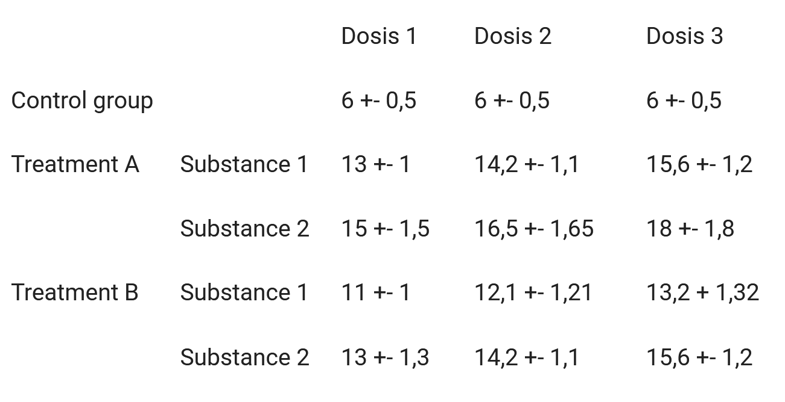
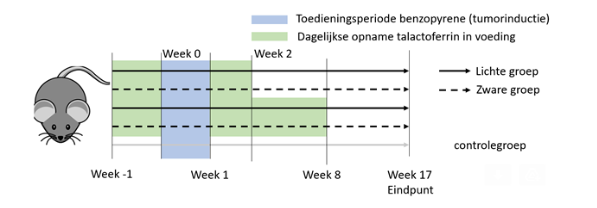

<script>
   $(document).ready(function() {
     $head = $('#header');
     $head.prepend('')
   });
</script>

<style type="text/css">
body{ /* Normal  */
	font-size: 20px;
	font-family: Avant Garde,Avantgarde,garamond;
	font-weight: 600;
	color: #000000
}
td {  /* Table  */
  font-size: 20px;
}
h1.title {
  font-size: 36px;
  font-family: "Avantgarde", garamond;
  color: #000000;
  font-weight: 600;
}
h1 { /* Header 1 */
  font-size: 32px;
  font-family: "Avantgarde", garamond;
  color: #003399;
  font-weight: 600;
}
h2 { /* Header 2 */
  font-size: 28px;
  font-family: "Avantgarde", garamond;
  color: #003399;
}
h3 { /* Header 3 */
  font-size: 24px;
  font-family: "Avantgarde", garamond;
  color: #003399;
}
h4 { /* Header 4 */
  font-size: 20px;
  font-family: "Avantgarde", garamond;
  color: #003399;
}
h5 { /* Header 5 */
  font-size: 20px;
  font-family: "Avantgarde", garamond;
  color: #ff6600;
}
code{ /* Code block */
    font-size: 16px;
	color: #003399;
	background-color: #ffffff;
}
a{
	color: #ff6600;
}
r{ /* Code block */
	color: #ff6600;
    font-size: 20px;
}
code.r{ /* Code block */
    font-size: 20px;
}
pre { /* Code block - determines code spacing between lines */
    font-size: 20px;
}
table td, table td * {
    vertical-align: top;
}
.rcode {
	font-size: 16px;
	color: #003399;
}
</style>

<!--

www.icds.be - how to communicate your methodology and statistics in a research proposal

Goal: introduce the key concepts in terms of methodology and statistics to include in a research proposal
Audience: focused on applications within the Wetenschappelijk Fonds Willy Gepts, can be used more broadly

Wilfried Cools
statistical consultant ICDS
wilfried.cools@vub.be
02 477 44 44

library(DiagrammeR)
mermaid("graph LR; A(confirmatory)---P{aim}; B(exploratory)---P{aim}; C(preparatory)---P{aim}; D(technological)---P{aim}; P{aim}---S[statistics]; P{aim}---Q{design}; S[statistics]---Q{design}; Q{design}---X(quantity); Q{design}---Y(quality); Q{design}---Z(generalization)")

-->

```{r global_options, include=FALSE}
knitr::opts_chunk$set(echo=FALSE, message=FALSE, warning=FALSE, fig.width=12, fig.height=6)
```

<!-- RUN:: working directory and libraries -->
```{r x_wd, echo=FALSE, eval=FALSE}
setwd("C:\\Users\\wcools\\Documents\\misc\\resources\\methodology")
```

<!-- Sys.setenv(RSTUDIO_PANDOC="C:/Program Files/RStudio/bin/pandoc")
fname <- "proposals"
rmarkdown::render(paste0(fname,".Rmd"),output_format=c('html_document'))
rmarkdown::render(paste0(fname,".Rmd"),output_format=c('pdf_document'))
# knitr::purl(paste0(fname,".Rmd"), output=paste0(fname,".r"))
-->

```{r}
library(tidyverse)
.nr <- function(slide){
	name <- paste0('slide',sprintf("%02d", slide))
	ref <- paste0('#slide',sprintf("%02d", slide+1))
	nr <- sprintf("%02d", slide)
	str_glue("<small><a name=\"",{name},"\" href=\"",{ref},"\">",{nr},"</a></small>")
}
```

`r sld<-0`

<br/>
Current draft (<font color="#FF6600"><small>`r format(Sys.time(), '%b %d, %Y')`</small></font>) aims to introduce researchers to the <small><a name=`r paste0('slide',sprintf("%02d", sld))` href=`r paste0('#slide',sprintf("%02d", sld+1))`>key ideas in research methodology</a></small> that would help them plan their study and write a research proposal. 
Our target audience is primarily the research community at VUB / UZ Brussel, those applying for funding at the WFWG in particular.     
<br/>  
Note that we present our view, suitable for communicating research at VUB / UZ Brussel, not necessarily outside. Therefore, what we present should only be used for guidance, not as an argument or proof of any kind.  
<br/>  
We invite you to help us improve this document by sending us feedback 
<br/>  wilfried.cools@vub.be or anonymously at <A HREF="https://www.icds.be/consulting">icds.be/consulting</A> (right side, bottom)
<br/>
<br/>
<br/>

\newpage

<!-- 4:40 -->

#  `r sld<-sld+1; .nr(sld)` Methodology and Statistics: Research Proposal
<br/>  

- convince referees that 
	- your study addresses interesting questions ~ WHY &rarr; peers
	- your study will be successful: effective ~ HOW &rarr; peers and maybe statisticians
	- your study will be successful with minimal costs: efficient ~ HOW
		- cost defined in terms of money, directly or indirectly, and/or ethically
			- at least, findings will outweigh the cost
			- ideally, findings obtained with minimal cost
		- cost valued dependent on type of application
			- funding: show return value of investment
			- ethical approval: show necessity of potential risk/harm/stress/...
<br/>  
- convince statisticians in particular
	- include necessary methodological / statistical arguments
	- in a way a statistical referee understands  (no clue about your area of expertise)
	- ideally separate the WHY and HOW, the latter read by statisticians

<br/>
<br/>
<br/>

<!-- 1:00 -->

# `r sld<-sld+1; .nr(sld)` Key Ingredients
<br/>  

- <u>aim</u> of the study: WHAT you want (confirmatory, exploratory, preparatory, techn(olog)ical)
- <u>design</u> of the study: HOW you can do it (quantity, quality, generalization)
- aim should match design: often linked by statistics
<br/>  
<br/>  

{width=75%}

<br/>
<br/>
<br/>

\newpage

<!-- 4:00 -->

## `r sld<-sld+1; .nr(sld)` Research Aim: first key ingredient
<br/>  

- research aim: concisely express what the study intends to achieve
	- frame in terms of the essence, avoid unnecessary (technical) details
	- be specific, go beyond very general statements
	- operationalize, relate to empirical evidence
<br/>  
- focus, highlight research questions of primary interest
	- argue what the results should be -at a minimum- for it to be a successful study
	- comment on additional gains the study could offer
<br/>  
- example: The aim is to show that the new treatment P is not worse than the common treatment Q, and we consider our study a success when the average score on measurement Y, with values expected between 16 and 64, is maximally 10% less for P. It will further be explored to what extent patient characteristics X could further explain the scores Y in both treatments.
	- detailed statement instead of 'investigate' treatment
	- linked to the empirical evidence
	- focus, not a vague list of measurements
<br/>
<br/>

<!-- 3:00 -->

### `r sld<-sld+1; .nr(sld)` Categorizations of Research Aims
<br/>  

- the type of research aim determines how to deal with it (properties and requirements)
- various categorizations can be considered, for example:
	- confirmatory / exploratory / preparatory / technological
	- quantitative / qualitative
	- inferential / descriptive
<br/>  
- note: type labels are informal, to be used for guidance only
- typically, studies tend to be valued more if
	- they build on an understanding of future results (without being certain)
	- they offer an future understanding beyond the study (wider / deeper)
	- thus: if you can, frame it as such
<br/>
<br/>

<!-- 3:00 -->

#### `r sld<-sld+1; .nr(sld)` Descriptive versus Inferential Research
<br/>  

- inferential, study a population using a sample, implies generalization
	- (ideally) uses representative samples, large enough, randomly sampled
	- more ambitious, thus difficult  &rarr; guarantee inference is possible
		- relates to statistical testing, estimation, prediction
- descriptive, study the observed data as such, no generalization
	- present data -as is- without reference to uncertainty nor p-values
	- easy to perform &rarr; argue that data in itself is of interest
		- relates to summaries (average, median, ..., correlation) and values
<br/>
- note: inferential studies typically imply descriptive preliminary analysis
<br/>

<br/>
<br/>

<!-- 4:30 -->

#### `r sld<-sld+1; .nr(sld)` Quantitative versus Qualitative Research
<br/>  

- quantitative research addresses quantifiable empirical aspects
	- typically makes use of visualization and statistics to summarize and generalize
	- can be descriptive and/or inferential
	- typically aims to reduce complexity (operationalization before data analysis)
	- main focus is summarizing and generalization &rarr; determines how to argues for it
<br/>
- qualitative research addresses understanding
	- especially focused on reasons, opinions, motivations, ... 
	- is descriptive and can be hypothesis generating (inductive)
	- typically embraces complexity
	- main focus is interpretation / understanding ~ meaning &rarr; determines how to argues for it
<br/>
- mixed methods combines both
<br/>
<br/>
- rarely pure one or other
- note: leaving out statistics does not make it a qualitative study
- note: asking respondents questions does not make it qualitative
<br/>
<br/>
<br/>
<br/>
<br/>

#### `r sld<-sld+1; .nr(sld)` Objectives: confirmatory, explanatory, preparatory, techn(olog)ical

<br/>
<br/>

<!-- 6:00 -->

##### `r sld<-sld+1; .nr(sld)` Confirmatory Research Aims
<br/>  

- goal:: <strong>confirm</strong> an expected difference, relation, ...
- means:: in advance specify results -at a minimum- to support claim
	- aim for
		- significant difference (superiority / non-inferiority) &rarr; statistical test
		- equivalence given a margin of error &rarr; statistical test
			- absence of evidence is not evidence of absence
		- accurate estimate &rarr; statistical estimation
		- expected observations &rarr; falsifying alternative hypotheses
		- ...
<br/>  
- focus::
	- explain (statistical) link research design and (especially) primary aim
	- for a statistical test or estimation &rarr; calculate sample size using standard error
		- make assumptions and conditions explicit: effect size, statistics, type I and II errors
		- conclude on required sample size: costs & availability

<br/>
<br/>

<!-- 5:30 -->

##### `r sld<-sld+1; .nr(sld)` Exploratory Research Aims
<br/>  

- goal:: <strong>explore</strong> observations, possible differences, relations, ... 
	- without any guarantee on what will be the results
- means:: in advance specify results -at a minimum- to support merit <br>(no reference to significance or accuracy)
	- interest in data as such (descriptive)
		- no -primary- interest in statistical testing or estimation
	- interest in parameter estimates (differences, relations, ...)
		- aim for statistical testing or estimation but
			- no guarantee sufficient power and/or accuracy
			- maybe try 'upgrading' it to confirmatory research ? &rarr; decide on effect of interest
	- interest in prediction
		- aim for cross-validation (does not include standard errors)
			- open question how to argue sample size, refer to similar research / common practice
			- possible to justify afterwards using bootstrapping &rarr; discuss criteria
	- qualitative research
<br/>  
- focus:: 
	- argue why the data or parameter estimates by themselves are of interest 
		- even if not significant/inaccurate
		- or why significance/accuracy is likely
			- based on similar existing research
		- put more weight on substantive arguments
	- sample size -justification- with balance information and cost
		- argue that merit outweighs cost
		- low cost of collection, or data already available (eg., retrospective)
	- still explain (statistical) link research design and potential inferences

<br/>
<br/>

<!-- 3:30 -->

##### `r sld<-sld+1; .nr(sld)` Preparatory Research Aims
<br/>  
  
- goal:: <strong>prepare</strong> for a future study... typically a small scale set-up
- means:: in advance specify what information is required for a future study and how it will be obtained
	- pilot study
		- aim to successfully set up future study
	- phase I and II clinical designs
		- aim to avoid risk, harm, ... future study
		- requires decision criteria to proceed or not
	- database development, data collection procedures, ...
<br/>  
- focus:: 
	- argue based on information required for future (actual) study
		- explain how unavailable information is obtained
		- argument could be (partially) qualitative, descriptive, ... 
			- example: understand instructions, register observations, ...
	- results are not by themselves of interest
		- no statistical testing is implied, that is for future (actual) studies
	- sample size -justification- based on an absolute minimal cost		
		- for example, with animal experiments typically 3 animals per condition
			- allow the estimation of variance
		- low cost of collection, or data already available (eg., retrospective)

<br/>
<br/>

<!-- 1:00 -->

##### `r sld<-sld+1; .nr(sld)` Techn(olog)ical advancements
<br/>  
  
- goal:: to design, engineer, create, ... not to extract information from the outside world
- means:: argue merit of the final product, rarely any statistics involved
- focus:: 
	- argument based on what the advancement offers, in balance with the costs
	- no statistical justification, and that is alright !!

<br/>
<br/>

<!-- 6:20 -->

## `r sld<-sld+1; .nr(sld)` Research Design: second key ingredient
<br/>  

- research design: strategy to achieve the research aim
	- effective (question can be answered) and efficient (with acceptable/minimal costs)
	- determines how (potential) observations provide information on research aim
		- a poor design makes a study inefficient at best, completely ineffective at worst
		- statistics can not solve design problems
		- example: study different treatment effects with fixed order ~ confounding  
<br/>  
- three types of design attributes
	- quantity of observations (sample size)
	- quality of observations, dependent on 
		- what is observed
		- how it is observed (method)
		- under which conditions it is observed (~ variables)
	- generalizability (from sample to population), dependent on 
		- selection/allocation of research units
		- missing data mechanism  
<br/> 
- focus, highlight the good choices when relevant
	- show what is done right, that you have it under control
	- discuss in relation to relevance, maybe name-drop
	- do not dwell on what you (may) fail to deal with  
<br/>
<br/>

<!-- 11:00 -->

### `r sld<-sld+1; .nr(sld)` Quantity of Observations
<br/>  

- collect enough relevant observations
	- more observations are more informative, ensure that sufficient (effective)
		- more observations required if they are less informative by themselves (see quality)
	- more observations may be more costly, ensure not too many (efficient)
		- remember, costs in terms of time, money, risk, stress, ... 
<br/>  
- justify quantity of observations
	- typically only required for the primary research questions, and/or costly observations
	- for confirmatory research, perform sample size -calculation-
		- specify statistical test(s) or estimation(s) in focus <br>(implied by what -at a minimum- ensures a successful study).
		- specify effect size aimed for, justify both the effect and the uncertainty
			- effect: ideally justified substantively or at least referring to common practice or literature
			- uncertainty: variance of measurement, ideally based on earlier data/research or pilot
			- use rules of thumb when all reasoning fails, only
		- specify operational characteristics (type I error $\alpha$ and type II error $\beta$ are related)
			- note: an $\alpha$ of .05 and power of .8 ($\beta$ = .2) implies type I error 4 times more severe
	- for exploratory / preparatory research this includes a sample size -justification-
		- feasibility and/or low cost
		- minimum requirement for a first impression
		- similar / equivalent research

<br/>
<br/>

<!-- 8:30 -->

### `r sld<-sld+1; .nr(sld)` Quality of Observations
<br/>  

- collect informative observations (especially important if relatively few)
	- observations made with most informative method
		- validity & reliability
		- example stress: 
			- self rating vs. neuro-endocrine vs. ...
			- memory vs. now vs. imagined situation vs. ...
	- observations made under the most informative conditions
		- link with research question
		- include suspected confounders
		- example stress:
			- short/long term difference - evolution
			- lab - naturalistic ?
<br/>  
- general principle: isolate the effect, avoid / measure unwanted influences
	- control confounding variables (~ complete the model)
	- maximize systematic variability (~ explained variance)
	- minimize non-systematic variability (~ unexplained variance)
<br/>  
- highlight how quality is ensured, lack of quality is avoided
	- show you have it under control, you know why you set up your study this way
	- be specific, relate to your research design and aim
	- do not highlight weaknesses (too strongly)

<br/>
<br/>

<!-- 6:00 -->

### `r sld<-sld+1; .nr(sld)` Quality of Observations --- Confounders
<br/>  

- explain control of confounding (unwanted outside influence)
	- balance out confounding
		- randomization (large enough sample size)
		- stratified randomization
	- measure confounding
		- repeated measures (~ conditioning)
		- cross-over designs (~ conditioning)
		- blocking, keep variances sources stable and estimate (~mini-experiments)
	- avoid confounding
		- matching, create similar groups to compare
		- (double-) blinding, avoid influence experimenter/experimented
	- and more ...
<br/>  
- often more complex designs are more efficient but also more complex to analyze
	- eg., mixed models to deal with repeated measures

<br/>
<br/>

<!-- 4:00 -->

### `r sld<-sld+1; .nr(sld)` Quality of Observations --- Non-Systematic Variability
<br/>  

- variability that is not understood ~ uncertainty
- explain minimization of non-systematic variability
	- use of proper measurement tools
		- ensure reliability / precision to avoid noisy measurements
		- combine measurement tools
		- repeat observations (replications) to average out noisy measurements
		- use tools that are well understood/studied
	- use of all information available
		- include all relevant predictors
			- not only focus on main variables of interest (~ model)
			- potentially consider combinations (interaction, polynomial, ...)
		- avoid the use of categories when continuous registrations are available
		- consider (multiple) imputation when missingness is modest

<br/>
<br/>

<!-- 2:00 -->

### `r sld<-sld+1; .nr(sld)` Quality of Observations --- Systematic Variability
<br/>  

- variability that is understood ~ information
- explain maximization of systematic variability
	- maximally differentiate conditions 
		- DoE, design of experiments
		- example: detect change, effectiveness, ...
	- largely implies minimization of non-systematic variability
		- ~ appropriate and sufficiently rich model for the observations

<br/>
<br/>

<!-- 2:00 -->

### `r sld<-sld+1; .nr(sld)` Quality of Observations --- Experimental Control
<br/>  

- safeguard quality of information easier if (some) control on conditions
	- experimental study, exerts control by definition
		- choose the conditions of observation
		- randomize the allocation to conditions
		- necessary condition for causal conclusions
	- observational study, does not exert control, efficiency loss at best
		- increase quantity to compensate loss in quality
		- includes naturalistic data collections, surveys, retrospective data collection, ...
<br/>  
- highlight what you can control, and how you use that control
<br/>
<br/>

<!-- 4:30 -->

### `r sld<-sld+1; .nr(sld)` Generalizability
<br/>  

- collect a sample of observations with the aim to generalize (inference)
	- conclude upon more than just the observed sample &rarr; avoid biased sampling
	- type of sampling
		- probabilistic (sampling: random, stratified, multi-stage, ....)
			- necessary for conclusive, unbiased, objective inferences
			- conclude upon population sampled from
		- non-probabilistic (sampling: diversity, expert, ....)
			- potentially biasing, more subjective, and best used only exploratory, descriptive
			- argue why not biasing in your case
			- no issue for qualitative studies

- missing data: safeguard against / remediate
	- generalization fails when substantial non-random missing data
		- depends on mechanism of missingness
			- problem if not at random &rarr; biased
			- results in loss of precision
	- explain how it is avoided and dealt with
		- how many missing values to expect, for what reason
		- what to do to further minimize this number
			- improve data collection
			- obtain information to deal with missingness
<br/>
<br/>

<!-- 4:30 -->

## `r sld<-sld+1; .nr(sld)` Statistics
<br/>  

- link between research design and research aim
	- highlight how given a design, statistics is able to resolve the aims
		- focus on primary research questions
		- sketch of secondary research questions &rarr; maybe do some name-dropping
	- reflect on the type of data and challenges they offer
		- continuous/ordinal/nominal
		- skewed, outliers, boundary values, ...
		- but avoid being vague or to give a lecture statistics 101
<br/>
- introduce intended statistical analysis
	- include
		- statistical tests (evaluate whether effects exist; p-values)
		- statistical estimation (evaluate confidence interval)
		- prediction (evaluate model fit using individual observations)
	- specify the expected inferences, be specific
<br/>
- note: sample size calculations are not part of statistics
	- often based on simplified statistical testing/estimation
	- typically not discussed separately

<br/>
<br/>

<!-- 2:00 -->

### `r sld<-sld+1; .nr(sld)` Small Example
<br/>  

The aim is to show that the proposed treatment is an improvement over the current standard method, as it will show in higher scores on my measurement. 

Participants are randomized to either the treatment or control group. The control group is given a dummy treatment of which a post experiment survey addresses whether participants were aware. Each participant is measured twice, once immediately before and once immediately after the (dummy) treatment was administered. Each measurement results in a continuous score on a 0-10 scale. A mixed model compares the change between post and pre treatment measurement while accounting for pre-treatment scores. Also the following possible confounders will be included: ...   

A sample size was derived for a t-test that focuses on the detection of a post-treatment difference of 2 in favor of the treatment. The minimal clinical difference was decided upon by our expert panel. In literature, the standard method is indicated to have a population standard deviation of about 4. Because no information is available on the new treatment it is assumed that the same population standard deviation applies. This leads to a sample size of 51 patients in each of both groups, required for a one-sided test, type I error of .05 and power of .8. Earlier experiments showed a drop-out of about 10%, so 51 * (100/(100-10)) < 57 patients are included per group. Because the more advanced statistical test and the inclusion of various potential confounders, this number can be considered conservative but realistic. This number will also present no difficulties to collect in our center. 

<br/>
<br/>

## `r sld<-sld+1; .nr(sld)` Some Practical Suggestions
<br/>  

- isolate methodological / statistical arguments from substantive reasoning
- use concise and consistent labeling of data and conditions
- visualize and structure wherever possible

	- data collection process
	- categories of observations and their relation

	- a text a statistical referee does not want to read

		We will compare the effect of [<small>treatment</small>] on [<small>condition</small>] by randomizing mice over groups with [<small>description of procedure the statistician does not need to know about</small>] and groups with [<small>description of another procedure the statistician does not need to know about </small></small>]. Each procedure will be performed with 2 [<small>substances</small>] and each at 3 different doses, namely [<small>dosages</small>].  
		We expect procedure A with substance 1, respectively substance 2 to achieve on average 13 units, respectively 15 units and a standard deviation of 1, respectively 1.5 at the lowest dosis, with a 10% increase in both mean and standard deviation at the second dosis and 20% increase for the third. For procedure B with substance 1, respectively substance 2 to achieve on average 11 units, respectively 13 units and a standard deviation of 1, respectively 1.3 at the lowest dosis, with a 10% increase in both mean and standard deviation at the second dosis and 20% increase for the third. We will also include a control group which achieves an average of 6 and standard deviation 0.5, where we expect dosis to have no effect.
		
	- could be turned into

		{width=70%}
	
	- experiments can also be visualized, eg., time-line
	
		
	
	- design: <br/>tables to list conditions between (rows) and within (columns)  

		

<br/>
<br/>
<br/>

\newpage

## `r sld<-sld+1; .nr(sld)` Conclusion
<br/>  

- be clear on your aim and how to reach it with an appropriate design
- highlight what is essential for your type of study
- highlight the good choices that you have made
- focus on what deserves focus
- use a language understood by the relevant referee
	- statistical lingo
	- visualization / structure
<br/>

{ width=70% }


<br/>
<br/>
<br/>
<br/>
<br/>

\newpage

# `r str_glue("<small><a name=\"",paste0('slide',sprintf("%02d", sld+1)),"\"></a></small>")` { width=40% }

<strong>Methodological and statistical support to help make a difference</strong>
  

- <small>ICDS provides complementary support in methodology and statistics to our research community, for both individual researchers and research groups, in order to get the best out of them</small>

- <small>ICDS aims to address all questions related to quantitative research, and to further enhance the quality of both the research and how it is communicated</small>

website: https://www.icds.be/ <small>includes information on who we serve, and how </small>

booking: https://www.icds.be/consulting/ <small>for individual consultations</small>  

<br/>
<br/>
<br/>
<br/>
<br/>
<br/>
<br/>
<br/>
<br/>
<br/>