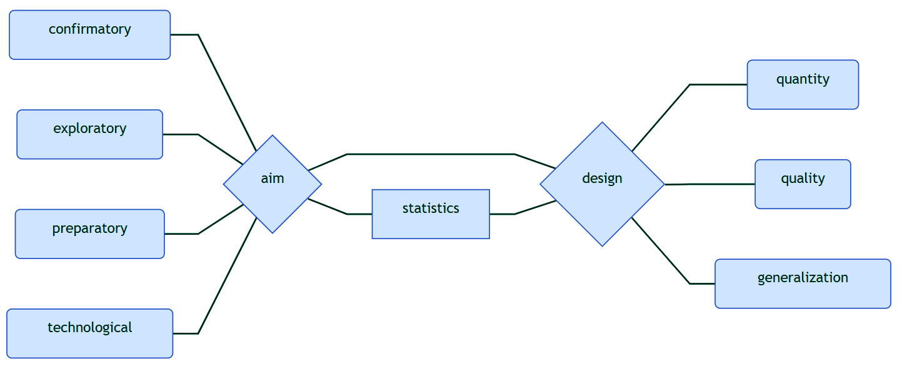
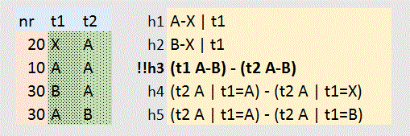

<style type="text/css">

body{ /* Normal  */
      font-size: 12px;
  }
td {  /* Table  */
  font-size: 8px;
}
h1.title {
  font-size: 38px;
  color: DarkRed;
}
h1 { /* Header 1 */
  font-size: 28px;
  color: DarkBlue;
}
h2 { /* Header 2 */
    font-size: 22px;
  color: DarkBlue;
}
h3 { /* Header 3 */
  font-size: 18px;
  font-family: "Times New Roman", Times, serif;
  color: DarkBlue;
}
code.r{ /* Code block */
    font-size: 12px;
}
pre { /* Code block - determines code spacing between lines */
    font-size: 14px;
}
</style>

<!--

www.icds.be - how to communicate your methodology and statistics in a research proposal

Goal: introduce the key concepts in terms of methodology and statistics to include in a research proposal
Audience: focused on applications within the Wetenschappelijk Fonds Willy Gepts, can be used more broadly

Wilfried Cools
statistical consultant ICDS
wilfried.cools@vub.be
02 477 44 44

library(DiagrammeR)
mermaid("graph LR; A(confirmatory)---P{aim}; B(exploratory)---P{aim}; C(preparatory)---P{aim}; D(technological)---P{aim}; P{aim}---S[statistics]; P{aim}---Q{design}; S[statistics]---Q{design}; Q{design}---X(quantity); Q{design}---Y(quality); Q{design}---Z(generalization)")

-->

```{r global_options, include=FALSE}
knitr::opts_chunk$set(echo=FALSE, message=FALSE, warning=FALSE, fig.width=12, fig.height=6)
```

<!-- RUN:: working directory and libraries -->
```{r x_wd, echo=FALSE, eval=FALSE}
setwd("C:\\Users\\wcools\\Documents\\misc\\resources\\methodology")
```

<!-- Sys.setenv(RSTUDIO_PANDOC="C:/Program Files/RStudio/bin/pandoc")
fname <- "proposals"
rmarkdown::render(paste0(fname,".Rmd"),output_format=c('html_document'))
rmarkdown::render(paste0(fname,".Rmd"),output_format=c('pdf_document'))
# knitr::purl(paste0(fname,".Rmd"), output=paste0(fname,".r"))
-->

<br/>
<br/>
<br/>
<br/>
<br/>

Current draft aims to introduce researchers to the key ideas in research methodology that would help them plan their study and write a research proposal. 
Our target audience is primarily the research community at VUB / UZ Brussel, those applying for funding at the WFWG in particular.  
<br/>  
Note that we present our view, suitable for communicating research at VUB / UZ Brussel, not necessarily outside. Therefore, what we present should only be used for guidance, not as an argument or proof of any kind.  
<br/>  
We invite you to help us improve this document by sending us feedback 
<br/>  wilfried.cools@vub.be or anonymously at www.icds.be/consulting (right side, bottom)
<br/>
<br/>
<br/>
<br/>

\newpage

# Methodology and Statistics: Research Proposal
<br/>  

- convince referees that 
	- your study can provide an interesting contribution to your field of research
	- your study will be successful: effective and efficient
	- your findings will outweigh the cost
		- to apply for funding: show return value of investment, for example scientific merit
		- to apply for ethical approval: show necessity of all potential risk/harm/stress/...
<br/>  
- beware: some referees are statisticians who do not understand your area of expertise
	- include necessary methodological / statistical components
	- in a way a statistical referee understands

<br/>
<br/>
<br/>

# Key Ingredients
<br/>  

- <u>aim</u> of the study: what you want (confirmatory, exploratory, preparatory, techn(olog)ical)
- <u>design</u> of the study: how you can do it (quantity, quality, generalization)
- aim should match design: often linked by statistics
<br/>  



<br/>
<br/>
<br/>

\newpage

## Research Aim
<br/>  

- research aim: concisely express what the study intends to realize
	- be specific, if necessary operationalize more general research questions explicitly
	- formulate the aim so that it can be evaluated empirically
<br/>  
- focus, highlight research questions of primary interest (what at a minimum makes your study worthwhile)
- be explicit, for research questions of primary interest specify what the results should be -at a minimum- for a successful study
- comment on additional gains the study could offer
<br/>  
- example: The aim is to show that the new treatment P is not worse than the common treatment Q. The study is successful when the scores on measurement Y are maximally 10% less for P. It will further be explored to what extent patient characteristics X could explain the scores Y in both treatments.

<br/>
<br/>

### Categorizations of Research Aims
<br/>  

- various categorizations can be considered, for example:
	- confirmatory / exploratory / preparatory / technological
	- quantitative / qualitative
	- inferential / descriptive
<br/>  
- each type has its properties and requirements
- note: presented type labels are informal, to be used for guidance only
<br/>
- example: The aim is confirmatory (establish non-inferiority), quantitative and inferential (generalization to population).

<br/>
<br/>

### Confirmatory (purpose A)
<br/>  
  
- goal:: <strong>confirm</strong> an expected difference, relation, ... <br/>maybe the aim is to establish a difference or a pre-specified certainty on a parameter estimate
- justification based partially on statistical <strong>test</strong> or accurate parameter estimate
- requirement::
	- justify what the results -at a minimum- should be (interesting enough) referring to significance or accuracy
	- calculate <strong>sample sizes</strong> to ensure the success of the study (power / accuracy of estimation)
	- justify costs and availability of observations implied by required sample size
	- explain (statistical) link research design and (especially) primary aim
<br/>
- note on statistical testing: the aim typically is to show a difference (reject equality) but sometimes involves
	- non-inferiority/superiority, show conditions are not worse/better with a pre-specified margin
	- non-equivalence, show similarity allowing a margin of tolerance
	- absence of evidence is not evidence of absence (only null hypotheses can be rejected)

<br/>
<br/>
<br/>

### Exploratory (purpose B)

- goal:: <strong>explore</strong>, evaluate differences, relations, ... without any guarantee on what will be the results
- justification without referring to significance or accuracy
	- focus A:: interest in the data as such, descriptive, with results being interesting whatever they are
		- while testing/accuracy is not the primary aim, it could be secondary (significance/accuracy is not guaranteed in advance)
	- focus B:: interest in parameter estimates, with large amounts of data available
		- without (strong) costs of data collection, or simply because available, relations/differences can be evaluated
	- focus C:: interest in evaluations outside the scope of statistical testing or estimation	
		- for example: predictive modeling is evaluated using cross-validation (does not include standard errors)
	- focus D:: most qualitative understanding is exploratory
- requirement:: 
	- argument based on substantive grounds or availability/low cost of observation
	- explain (statistical) link research design and potential inferences
	- sample size -justification- stresses a balance between information and cost


<br/>
<br/>
<br/>

### Preparatory (purpose C)
  
- goal:: <strong>prepare</strong> for a future study... typically a small scale set-up
- justification by information offered for future study and merit of future study, results are not by themselves of interest
	- focus A: phase I and II clinical designs
		- decide on whether further studies would be of high enough potential while accounting for the costs involved, it requires decision criteria to proceed or not
	- focus B: pilot study, which serve to prepare to implement a future study
		- no statistical testing is implied, that is for the actual study
		- not in itself of interest, therefore not intended for publication
		- could be (partially) qualitative, descriptive, ... as long as it is of interest for the future study
	- focus C: database development or data collection procedures
		- no statistical testing is implied, that is for future studies
		- not for publication
- requirement:: 
	- argument based on the information that is still unavailable to set up a future study
	- explain how study offers the required but unavailable information
	- sample size -justification- based on an absolute minimal cost
		- for example, with animal experiments typically 3 animals per condition to allow the estimation of variance


<br/>
<br/>
<br/>

### Techn(olog)ical advancements  (purpose D)

- goal:: to design, engineer, create, ... not to extract information from the outside world
- justification by the merit of the final product, rarely there is any statistics involved
- requirement:: 
	- argument based on what the advancement offers, in balance with the costs
	- no statistical justification

<br/>
<br/>
<br/>

### Additional distinctions in aim

- quantitative versus qualitative research
	- quantitative research focuses on quantifiable empirical aspects
		- typically makes use of visualization and statistics to summarize and generalize, can be descriptive and/or inferential
		- typically aims to reduce complexity (operationalization before data analysis)
	- qualitative research focuses on understanding
		- especially focused on reasons, opinions, motivations, ...  , is descriptive and can be hypothesis generating
		- typically embraces complexity
<br/>
<br/>
- descriptive versus inferential research
	- inferential, study population using a sample, implies generalization and therefore (ideally) representative samples, large enough, randomly sampled
	- descriptive, study observed data as such, present data as is without reference to uncertainty nor p-values
<br/>
<br/>
- note:: while used here to show distinctions, they can be combined into one study


<br/>
<br/>
<br/>
<br/>
<br/>

\newpage

## Research Design

- the research design is the strategy to achieve the research aim
	- it can include data collection, measurement characteristics, and even the intended analyses
	- in a strict sense, determines how (potential) observations provide information
<br/>  
- popular saying: garbage in... garbage out !
	- a poor design makes a study inefficient at best, completely invalid at worst
	- statistics can not solve design problems   
<br/>
- there are three types of design attributes, four if you count statistics
	- quantity of observations (sample size) which should be sufficient
	- quality of observations, dependent on 
		- conditions under which observations are made
		- what is observed
		- method of observation (how)
	- generalizability (from sample to population), dependent on 
		- selection of research units
		- missing data mechanism
	- relation with statistical analysis

<br/>
<br/>
<br/>
<br/>
<br/>

### Quantity of Observations

- observations should provide information on the questions of interest
	- implies more observations are more informative
	- but, observations imply a cost which can be a reason not to make too many
	- costs can exist in terms of time, money, risk, stress, ... 
<br/>
- justify quantity of observations
	- for confirmatory research this includes a sample size -calculation-
		- specify statistical test or estimation in focus (should reflect what the result -at a minimum- should be to make the study successful.
		- specify effect size aimed for, justify both the effect and the uncertainty
			- effect: what you want to find, ideally justified substantively or at least referring to common practice / earlier research
			- uncertainty: variance of your measurement, ideally based on earlier data/research or a pilot study
			- use rules of thumb when all reasoning fails, only
		- specify operational characteristics (type I error $\alpha$ and type II error $\beta$ are related)
			- note: an $\alpha$ of .05 and power of .8 ($\beta$ = .2) imply that type I errors are 4 times more sever than type II errors
		- note: do not calculate power / sample size -after- analyzing the data
	- typically only required for the primary research questions
	- for exploratory research this includes a sample size -justification-
		- feasibility and/or low cost

<br/>
<br/>
<br/>
<br/>
<br/>

### Quality of Observations

- observations should provide information on the questions of interest
	- implies high enough quality which depends on the conditions under which observation are made, the method of observation, and what is observed
	- with effectiveness (question can be answered) and efficiency (with minimal costs)
<br/>
- general principle: isolate the effect, either by avoiding or by measuring any unwanted influences
	- control confounding variables (influence not in the model)
	- maximize systematic variability (explained variance)
	- minimize non-systematic variability (unexplained variance)
<br/>  
- note: enforcing general principle typically implies control, at least to some extent, over data collection process
	- an experimental study exerts control, by definition, thus potentially offers higher quality
		- necessary condition for causal conclusions
	- observational study does not exert control, efficiency will probably reduce
		- maybe increase quantity to compensate part of the loss in quality
		- includes naturalistic data collections, surveys, retrospective data collection, ...


<br/>
<br/>
<br/>

### Quality of Observations --- Confounders

- explain how confounding is avoided
	- randomization (large enough sample size), to balance out different sources of unwanted influence
	- repeated measures, to keep various sources stable and estimate their variance
	- blocking, to keep various sources stable and estimate their variance
	- cross-over designs, to create within unit comparisons and estimate order effects
	- matching, to avoid unnecessary unwanted influence
	- (double-) blinding, to avoid unwanted influence from knowing the goal of the study
	- and more ...
<br/>
- often more complex designs are more efficient but also more complex to analyze (eg., mixed models to deal with repeated measures)


<br/>
<br/>
<br/>

### Quality of Observations --- (Non-) Systematic Variability

- explain how systematic variability is maximized (about including everything of importance)
	- about the use of proper and well registered explanatory variables
	- about specifying appropriate relations between these variables and the observations
	- about the use of maximally differentiating conditions (eg., DOE, design of experiments)
		- beware: a focus on extremes can introduce artifacts or miss important information
<br/>  
- explain how non-systematic variability is minimized (about avoiding everything irrelevant)
	- about the maximization of systematic variability (reduce residual error)
	- about the use of proper measurement tools
		- ensure reliability / precision to avoid noisy measurements
		- combine measurement tools to estimate reliability
	- about the use of all information available
		- avoid the use of categories when continuous registrations are available
		- consider multiple imputation when missingness is modest

<br/>
<br/>
<br/>

### Generalizability

- explain generalizability (inference)
	- about the type of sampling
		- probabilistic (sampling: random, stratified, multi-stage, ....), necessary for conclusive, unbiased, objective inferences
		- non-probabilistic (sampling: diversity, expert, ....), potentially biasing, more subjective, and best used only exploratory
	- about missing data
		- depends on mechanism of missingness (problem if not at random)
		- explain how it is avoided and dealt with

<br/>
<br/>
<br/>

### Small Example

The aim is to show that the proposed treatment is an improvement over the current standard method. 

Participants are randomized into two groups, treatment and control. The control group is given a dummy treatment. A post experiment survey addresses whether participants were aware about dummy treatment. Each participant is measured once, immediately after the (dummy) treatment was administered which results in one score per patient, continuous on a 0-10 scale. A t-test for independent means is used to evaluate whether the scores in the treatment group are higher than those in the control group. 

A sample size was derived for the t-test to detect a minimal difference of 2 in favor of the treatment, which was decided upon by our expert panel. In literature, the standard method is indicated to have a population standard deviation of about 4. Because no information is available on the new treatment it is assumed that the same population standard deviation applies. This leads to a sample size of 51 patients in each of both groups, required for a one-sided test, type I error of .05 and power of .8. Earlier experiments showed a drop-out of about 10%, so 51/9*10 < 57 patients are included per group. 


<br/>
<br/>
<br/>
<br/>
<br/>

\newpage

## Statistics

- link between research design and research aim (extra information from observations)
	- highlight how given a design, statistics is able to resolve the aims
		- focus on primary research questions
		- sketch of secondary research questions
	- reflect on the type of data and challenges they offer
		- continuous/ordinal/nominal
		- skewed, outliers, boundary values, ...
<br/>
- includes
	- statistical tests (evaluate whether effects exist; p-values)
	- statistical estimation (evaluate confidence interval)
	- prediction (evaluate model fit using individual observations)
- introduce intended statistical analysis
<br/>
- note: sample size calculations are not part of statistics


<br/>
<br/>
<br/>
<br/>
<br/>

\newpage

## Practical Suggestions

- isolate methodological / statistical arguments from substantive reasoning
- use consistent labeling of data and conditions
- visualize wherever possible
	- data collection process (time-line)
	- categories of observations and their relation
	- design: <br/>tables to list conditions between (rows) and within (columns)  



<br/>
<br/>
<br/>

## Conclusion

- be clear on your aim and how to reach it with an appropriate design
- be clear on all relevant methodological and statistical aspects of your study
- use a language understood by the relevant referee
	- statistical lingo
	- visualization
- for support, maybe turn to ICDS
<br/>

{ width=70% }


<br/>
<br/>
<br/>
<br/>
<br/>

\newpage

# { width=40% }

<strong>Methodological and statistical support to help make a difference</strong>
  

- <small>ICDS provides complementary support in methodology and statistics to our research community, for both individual researchers and research groups, in order to get the best out of them</small>

- <small>ICDS aims to address all questions related to quantitative research, and to further enhance the quality of both the research and how it is communicated</small>

website: https://www.icds.be/ <small>includes information on who we serve, and how </small>

booking: https://www.icds.be/consulting/ <small>for individual consultations</small>  
